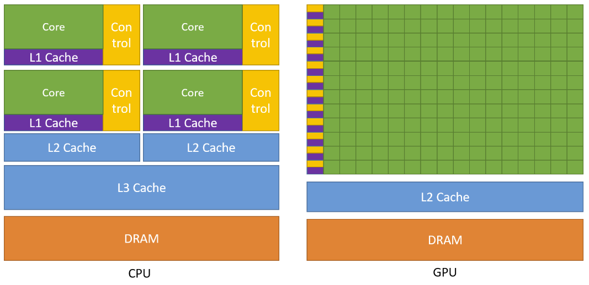
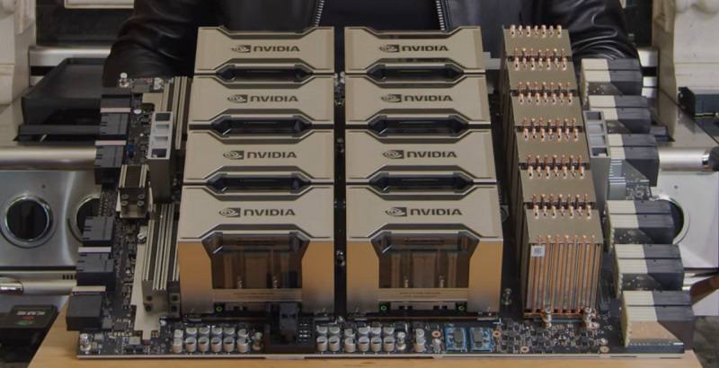
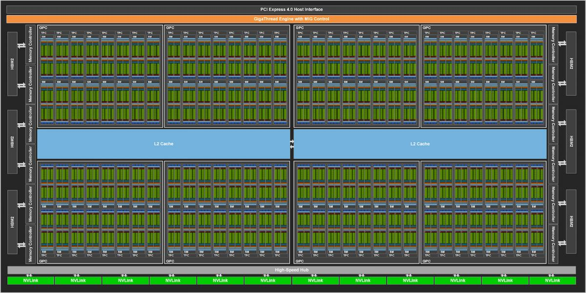

# CUDA. Taming 10'000 Cores

Or how to get a 100x performance at the same TDP?

<br/>

Ashot Vardanian
Founder, [Unum](https://unum.cloud)

- - - -

## Let's Revisit Our Questionaires: Bit-mangling


- - - -

## Bit fields in GCC vs Visual Studio C/C++

```c
struct S
{
	uint8_t		foreground : 4;
	uint8_t		background : 4;
} __attribute__((__packed__)) S;
```

GCC
foreground:  `11110000`
background: `00001111`

VS C/C++
foreground: `00001111`
background: `11110000`

To have same bitfield layout in both compilers use: `__attribute__((ms_struct))`

- - - -

## `goto` Fun

1. Cleanly exiting a function
2. Exiting nested loops
3. Low-level performance improvements

Computed GOTOs:

```c
    void *arr[] = {&&L0, &&L1};
L0:
    goto *arr[1];
L1:
    goto *arr[0];
```

- - - -

## Let's Revisit Our Questionaires: GOTOs


- - - -

## Lets reflect on history and future

Meetup #1: SIMD by Unum
Meetup #2: Testing by PicsArt, C++ Evolution by Unum
**Meetup #3: CUDA by Unum**
Meetup #4: Benchmarking by Mentor & Unum
Meetup #5: Suggestions for March?

- - - -

## Who Am I?

@ashvardanian on Telegram, [FB](https://fb.com/ashvardanian) & [LinkedIn](https://linkedin.com/in/ashvardanian/)

Over 10 years of C++ experience

Gave lectures on C++ conferences in Russia, Germany & US

Interests: #SIMD #GPGPU #HPC #CS

- - - -

## Talk Plan

* GPU Hardware
* Memory Model
* OpenCL vs CUDA
* Parallel Reductions
* Benchmarks

- - - -

## CPU vs GPU



- - - -

## A100



- - - -

## A100 Zoom In



- - - -

## A100 Specs


- - - -

## C++ Function Signature

```cpp
float accumulate(
    float const *begin
    float const *end
);
```

- - - -

## OpenCL Function Signature

```cpp
__kernel void accumulate(
    global float const *begin
    global float const *end,
    global float * result
);
```

- - - -

## CUDA Function Signature

```cpp
__global__ void accumulate(
    float const *begin
    float const *end,
    float * result
);
```

- - - -

## Looks similar, right?


- - - -

## Similar deception


- - - -

## How are they different? Historically


- - - -

## What was OpenCL?


- - - -

## Where similarities end?

CUDA is much closer to C++ and is actively maintained:

* Heterogeneous ✔️
* Templates ✔️
* Same compiler ✔️
* Atomics ✔️
* Library ecosystem ✔️

Latest NVCC supports C++17, but not C++20.

- - - -

## Problems with OpenCL

* Deprecated
* Slower than CUDA on Nvidia GPUs
* No support for generics and even proper includes

So we will focus just on CUDA.

- - - -

## Start with T(h)rust

C++:

```cpp
std::accumulate(x.begin(), x.end(), 0.f);
```

CUDA:

```cpp
thrust::reduce(x.begin(), x.end(), 0.f);
```

- - - -

## Get used to `reduce`

C++ 17: **87 GB/s**

```cpp
std::reduce(std::execution::par_unseq, x.begin(), x.end(), 0.f);
```

CUDA: **743 GB/s**

```cpp
thrust::reduce(x.begin(), x.end(), 0.f);
```

- - - -

## What's inside?


- - - -

## What's the alternative?


- - - -

## How is it implemented?

Every global function, is an entry point to GPU code.
Even without explicit arguments, it knows it's role.
You can think of it like this:

```cpp
struct task_idx_t {
    int blockIdx;
    int threadIdx;
};
__global__ void kernel_entry(task_idx_t);
```

- - - -

## But the logical segmentation isn't always 1D

It can be 1D, 3D or 2D, like in this case below.
2D should become the most common case for raw CUDA kernels.


- - - -

## Lets look at a simple kernel

```cpp
__global__ void MatAdd(float A[N][N], float B[N][N],
                       float C[N][N]) {
    int i = threadIdx.x;
    int j = threadIdx.y;
    C[i][j] = A[i][j] + B[i][j];
}

int main() {
    ... // Define A, B, C, N
    int numBlocks = 1;
    dim3 threadsPerBlock(N, N);
    MatAdd<<<numBlocks, threadsPerBlock>>>(A, B, C);
}
```

- - - -

## Is MatMul that easy?

```cpp
__global__ void MatMul(float A[N][N], float B[N][N],
                       float C[N][N]) {
    int i = threadIdx.x;
    int j = threadIdx.y;
    for (int k = 0; k != N; ++k)
      C[i][j] += A[i][k] + B[k][j];
}

int main() {
    ... // Define A, B, C, N
    int numBlocks = 1;
    dim3 threadsPerBlock(N, N);
    MatMul<<<numBlocks, threadsPerBlock>>>(A, B, C);
}
```

- - - -

## We forgot about L2

```cpp
__global__ void MatMul(float A[N][N], float B[N][N],
                       float C[N][N]) {
    float CValue = 0;
    int Row = blockIdx.y*TILE_DIM + threadIdx.y;
    int Col = blockIdx.x*TILE_DIM + threadIdx.x;

    __shared__ float As[TILE_DIM][TILE_DIM];
    __shared__ float Bs[TILE_DIM][TILE_DIM];

    for (int k = 0; k < (TILE_DIM + ACols - 1)/TILE_DIM; k++) {
        As[threadIdx.y][threadIdx.x] = A[Row*ACols + k*TILE_DIM + threadIdx.x];
        Bs[threadIdx.y][threadIdx.x] = B[(k*TILE_DIM + threadIdx.y)*BCols + Col];
        __syncthreads();

        for (int n = 0; n < TILE_DIM; ++n)
            CValue += As[threadIdx.y][n] * Bs[n][threadIdx.x];
        __syncthreads();
    }
    C[((blockIdx.y * blockDim.y + threadIdx.y)*CCols) +
       (blockIdx.x * blockDim.x)+ threadIdx.x] = CValue;
}
```

- - - -

## Explicit Thread Synchronization


- - - -

## Explicit Thread Synchronization Variants

* `__syncthreads` and `__threadfence`: intra-block level
* `__threadfence_block`: inter-block level for global memory ops

- - - -

## Accumulation, the hardest task!

```cpp
__global__ void reduce_warps(float const *inputs, unsigned int input_size, float *outputs) {
    float sum = 0;
    for (unsigned int i = blockIdx.x * blockDim.x + threadIdx.x; i < input_size; i += blockDim.x * gridDim.x)
        sum += inputs[i];

    __shared__ float shared[32];
    unsigned int lane = threadIdx.x % warpSize;
    unsigned int wid = threadIdx.x / warpSize;

    sum = reduce_warp(sum); // Important
    if (lane == 0)
        shared[wid] = sum;
    __syncthreads();

    sum = (threadIdx.x < blockDim.x / warpSize) ? shared[lane] : 0;
    if (wid == 0)
        sum = reduce_warp(sum); // Important
    if (threadIdx.x == 0)
        outputs[blockIdx.x] = sum;
}
```

- - - -

## How to reduce a warp?

Since Kepler, we have shuffles:

```cpp
int i = threadIdx.x % 32;
int j = __shfl_down(i, 2, 8);
```


- - - -

## What if we do it a few times?

Drop the noise and keep the prefix!


- - - -

## Final Code

Modernized for Ampere:

```cpp
__inline__ __device__ float reduce_warp(float val) {
    val += __shfl_down_sync(0xffffffff, val, 16);
    val += __shfl_down_sync(0xffffffff, val, 8);
    val += __shfl_down_sync(0xffffffff, val, 4);
    val += __shfl_down_sync(0xffffffff, val, 2);
    val += __shfl_down_sync(0xffffffff, val, 1);
    return val;
}
```

- - - -

## Let's build!

Before CUDA:

```
project(gpgpu LANGUAGES CXX)
set(CMAKE_CUDA_STANDARD 17)
```

With CUDA:

```
project(gpgpu LANGUAGES CXX CUDA)
set(CMAKE_CUDA_STANDARD 17)
set(CMAKE_CXX_STANDARD 17)
set_target_properties(reduce PROPERTIES CUDA_ARCHITECTURES "86")
```

- - - -

## What was this for? 800 GB/s


- - - -

## Use the ecosystem

* Parallel Algorithms will build on Thrust
* Thrust builds on CUB
* CUB implement CUDA kernels

Go as deep as you need to!

- - - -

## Use Thrust Containers to simplify allocations

Not much diversity here.
Parallel architectures require SoA, not trees, not AoS.

* `thrust::host_vector<float>`
* `thrust::device_vector<float>`

- - - -

## Are we missing kernel fusion?


- - - -

## Not with Expression Templates

Kernel fusion gives massive performance improvements.
But we can get them without a new compiler - simply composing iterators.

* `thrust::discard_iterator`
* `thrust::constant_iterator`
* `thrust::transform_iterator`
* `thrust::reverse_iterator`
* `thrust::permutation_iterator`

- - - -

## How to use CUB?

```cpp
auto num_items = static_cast<int>(gpu_inputs.size());
auto ins = gpu_inputs.data().get();
auto outs = gpu_sums.data().get();

// Determine temporary device storage requirements
cudaError_t error;
void *temps = nullptr;
size_t temps_size = 0;
error = cub::DeviceReduce::Sum(temps, temps_size, ins, outs, num_items);
assert(error == cudaSuccess);

// Allocate temporary storage, if needed
if (temps_size > temporary.size())
    temporary.resize(temps_size);
temps = temporary.data().get();

error = cub::DeviceReduce::Sum(temps, temps_size, ins, outs, num_items);
assert(error == cudaSuccess);
cudaDeviceSynchronize();

cpu_sums = gpu_sums;
return cpu_sums[0];
```

- - - -


- - - -

## Programming Tensor Cores

What C++ intrinsics would look like?

```cpp
using tf32_t = wmma::precision::tf32;
using rm_t = wmma::row_major;
wmma::fragment<wmma::matrix_a, 16, 16, 8, tf32_t, rm_t> a_tile;
wmma::fragment<wmma::matrix_b, 16, 16, 8, tf32_t, rm_t> b_tile;
wmma::fragment<wmma::accumulator, 16, 16, 8, float> c_tile;
```

Just one arithmetical operation:

```cpp
wmma::fill_fragment(a_tile, 0.0f);
wmma::load_matrix_sync(b_tile, &shared[0][0], 16);
wmma::mma_sync(c_tile, a_tile, b_tile, c_tile);
```

- - - -


- - - -

## Thank you for your attention!

Ashot Vardanian

[Unum.cloud](unum.cloud), [Unum.am](unum.am)

<br/>
<br/>
<br/>
<br/>

> I generated this presentation using [Marp](https://marp.app).
> Try it for your next presentation!
