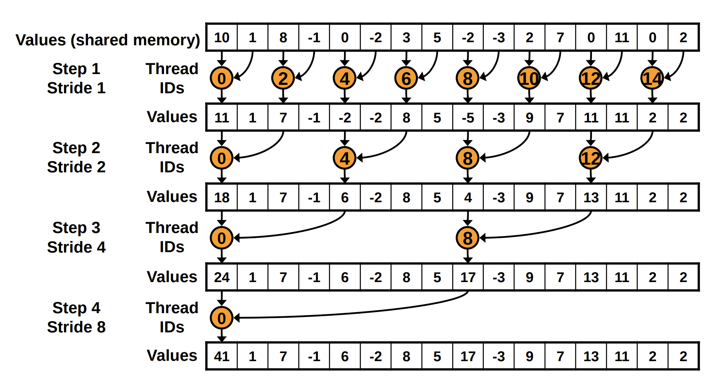
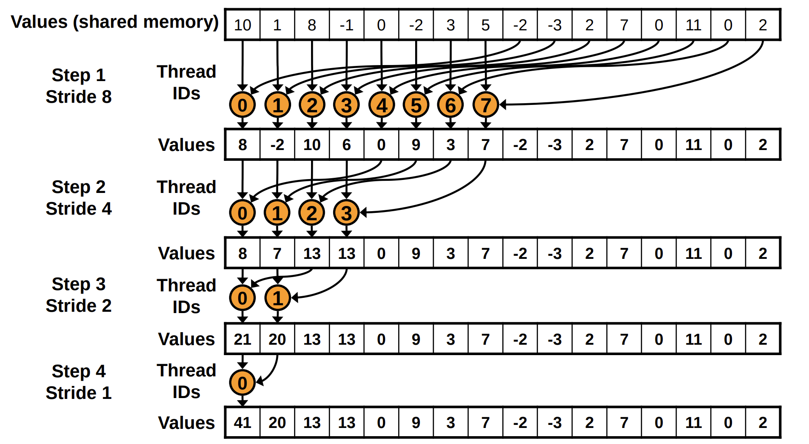
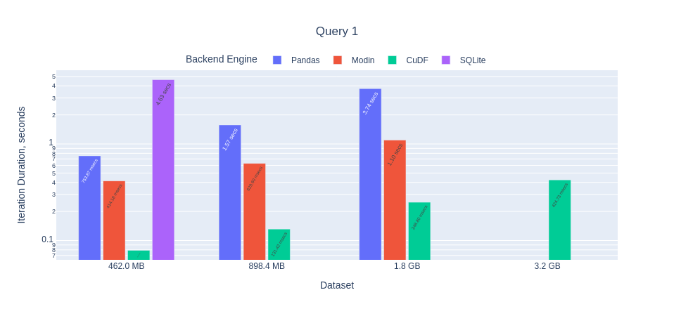
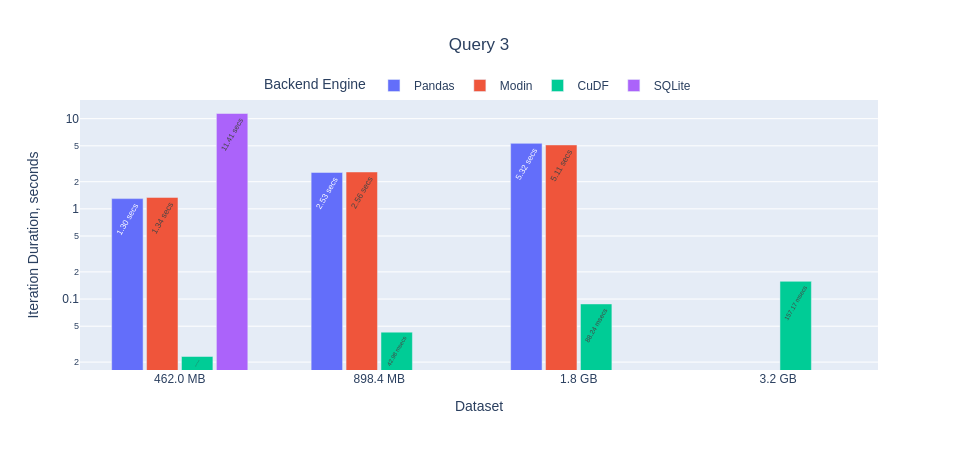

# Accelerated DataScience Tools Overview

On choosing the right tool between **Pandas**, Modin, Dask, CuDF, SQLite, Spark, **NumPy**, CuPy, **NetworkX**, CuGraph and RetworkX

--

By Ashot Vardanian
Founder @ [Unum.Cloud](unum.cloud)

[linkedin.com/in/ashvardanian](linkedin.com/in/ashvardanian)
[fb.com/ashvardanian](fb.com/ashvardanian)
[t.me/ashvardanian](t.me/ashvardanian)

---

## Hardware

* Multi-core CPUs
* Highly-parallel GPUs

100 - 10'000 threads/device.
200+ Gbit networking.
Datasets 100x bigger than RAM.

---

## CPU vs GPU


---

## A100 Zoom In


---

## How to sum some numbers?

Python:

```python
sum(x)
```

C++:

```cpp
std::accumulate(x.begin(), x.end(), 0.f);
```

---

## Accumulation, the hardest task!

```cpp
__global__ void reduce_warps(float const *inputs, unsigned int input_size, float *outputs) {
    float sum = 0;
    for (unsigned int i = blockIdx.x * blockDim.x + threadIdx.x; i < input_size; i += blockDim.x * gridDim.x)
        sum += inputs[i];

    __shared__ float shared[32];
    unsigned int lane = threadIdx.x % warpSize;
    unsigned int wid = threadIdx.x / warpSize;

    sum = reduce_warp(sum); // Important
    if (lane == 0)
        shared[wid] = sum;
    __syncthreads();

    sum = (threadIdx.x < blockDim.x / warpSize) ? shared[lane] : 0;
    if (wid == 0)
        sum = reduce_warp(sum); // Important
    if (threadIdx.x == 0)
        outputs[blockIdx.x] = sum;
}
```

---

## What's inside?



---

## What's the alternative?




---

## Why Suffer?

Python: **1 GB/s**

```python
sum(x)
```

C++ 17: **87 GB/s**

```cpp
std::reduce(std::execution::par_unseq, x.begin(), x.end(), 0.f);
```

CUDA: **789 GB/s**

---

## Can Performance Be Usable?

Python:

```python
sum(x)
```

C++:

```cpp
std::accumulate(x.begin(), x.end(), 0.f);
```

CUDA + Thrust:

```cpp
thrust::reduce(x.begin(), x.end(), 0.f);
```

---

## If C++ can be readable, can Python be FAST?

* NumPy → CuPy
* NetworkX → CuGraph or RetworkX
* Pandas →
  * Modin is Multi-Threaded
  * Dask is Multi-Node
  * CuDF is on GPUs
  * Dask-CuDF is Multi-Node on GPUs

---

## Change is ~~Hard~~ Easy

```python
# import numpy as np
import cupy as np

np.matmul(mat, mat)
```

Yields us almost compatiable API!

```python
# np.random.rand(100, 100).astype(np.float32)
cupy.random.rand(100, 100, dtype=np.float32)
cupy.cuda.stream.get_current_stream().synchronize()
```

---

## Calm your Horses! CPUs have something to say...

Let's check our configs:

```yml
name: benchmark
channels:
  - conda-forge
  - defaults
dependencies:
  - numpy
```

Do you know what you are getting?

---

## The Preceise Way

```yml
dependencies:
  - 'blas=*=mkl'
  - numpy
```

or:

```yml
dependencies:
  - 'blas=*=openblas'
  - numpy
```

---

## What Have We Achieved?

In short, up to [1000x performance improvements!](https://unum.cloud/post/2022-01-26-cupy/#installation--configuration)


---

## Tell us more! What's up with Graphs?

* NetworkX = Python
* RetworkX = Rust 🤮
* CuGraph = CUDA 🔥

---

## How close are they?

```python
networkx.weakly_connected_components(g)
```

```python
retworkx.weakly_connected_components(g)
```

```python
cugraph.components.connectivity.weakly_connected_components(g)
```

---

## How close are they? Reality

```python
networkx.pagerank(g)
```

```python
raise NotImplemented()
```

```python
cugraph.pagerank(g)
```

---

## How close are they? Algorithm Mismatch

```python
networkx.spring_layout(g)
```

```python
retworkx.spring_layout(g)
```

```python
cugraph.force_atlas2(g)
```

---

## What Are We Fighting For? Speed!


For Bitcoin Graph: **124x** improvement!

---

## PageRank


On big graphs: **247x** improvement!

---

## No Guarantees


Stack: 1.6 GB.
Orkut: 1.7 GB.

---

## What about Tabular Data?

Let's take the [Taxi Rides Dataset!](https://tech.marksblogg.com/benchmarks.html)

```sh
aws s3 ls --recursive s3://ursa-labs-taxi-data/ --recursive --human-readable --summarize
aws s3 sync s3://ursa-labs-taxi-data/ ADSB
```

Or in R:

```r
arrow::copy_files("s3://ursa-labs-taxi-data", "nyc-taxi")
```

Producing 40 GB in clean Parquet files.

---

## What will we do? SQL time!

Query 1 in SQL:

```sql
SELECT cab_type,
       count(*)
FROM trips
GROUP BY 1;
```

In Pandas:

```python
selected_df = trips[['cab_type']]
grouped_df = selected_df.groupby('cab_type')
final_df = grouped_df.size().reset_index(name='counts')
```

---

## Query 2: Average by Group

```sql
SELECT passenger_count,
       avg(total_amount)
FROM trips
GROUP BY 1;
```

In Pandas:

```python
selected_df = trips[['passenger_count', 'total_amount']]
grouped_df = selected_df.groupby('passenger_count')
final_df = grouped_df.mean().reset_index()
```

---

## Query 3: Transform & Histogram

```sql
SELECT passenger_count,
       extract(year from pickup_datetime),
       count(*)
FROM trips
GROUP BY 1,
         2;
```

Our dataset contains dates in the following format: "2020-01-01 00:35:39".

```python
selected_df = trips[['passenger_count', 'pickup_datetime']]
selected_df['year'] = pd.to_datetime(
    selected_df.pop('pickup_datetime'), 
    format='%Y-%m-%d %H:%M:%S'
).dt.year
grouped_df = selected_df.groupby(['passenger_count', 'year'])
final_df = grouped_df.size().reset_index(name='counts')
```

---

## Query 4: All Together

```sql
SELECT passenger_count,
       extract(year from pickup_datetime),
       round(trip_distance),
       count(*)
FROM trips
GROUP BY 1,
         2,
         3
ORDER BY 2,
         4 desc;
```

```python
selected_df = trips[['passenger_count', 'pickup_datetime', 'trip_distance']]
selected_df['trip_distance'] = selected_df['trip_distance'].round().astype(int)
selected_df['year'] = pd.to_datetime(selected_df.pop('pickup_datetime'), format='%Y-%m-%d %H:%M:%S').dt.year
grouped_df = selected_df.groupby(['passenger_count', 'year', 'trip_distance'])
final_df = grouped_df.size().reset_index(name='counts')
final_df = final_df.sort_values(['year', 'counts'], ascending=[True, False]) 
```

---

## Porting to Pandas and beyond!

* Pandas supports `reset_index(name='')` on series, but not on frames. Other libraries mostly don't have that so we rename afterwards for higher compatiability.
* In queries 3 and 4 we could have fetched/converted data from the main source in just a single run, but to allow lazy evaluation of `WHERE`-like sampling queries, we split it into two step.
* Major problem in Dask is the lack of compatiable constructors, the most essential function of any class. You are generally expected to start with Pandas and cuDF and later [convert those](https://docs.dask.org/en/stable/generated/dask.dataframe.from_pandas.html#dask.dataframe.from_pandas).

---

## Results: Parsing


Pandas compatiability: CuDF ✅, Modin ✅

---

## Results: Query 1



Pandas compatiability: CuDF ✅, Modin ✅

---

## Results: Query 2


Pandas compatiability: CuDF ✅, Modin ✔️

---

## Results: Query 3



Pandas compatiability: CuDF ✅, Modin ✔️

---

## Results: Query 4


Pandas compatiability: CuDF ✅, Modin ✔️

---

## What's next?

* Extending NumPy comparisons: + JAX, + ATen.
* Publishing more tabular results: Dask, Spark.
* Machine Learning benchmarks: PT, TF, JAX.

---

## General Recommendations

* Always provide `dtype`, don't use `float`.
* Power-of-two array sizes.
* Prefer symmetrical tensors.
* Structure-of-Arrays instead of Array-of-Structures.

---

## Known Pitfalls

* Multi-GPU.
* Unified Memory Latencies.
* NV-Link vs NUMA nodes and AMD MI200.
* Synchronization of CUDA streams and graphs.

---

## Where we apply?

* Processing 50 GB/s on a single machine.
* Rapid experimnatation with datasets between 100 MB and 4 GB.
* Fast experimentation with dataset above 4 GB.

All at [Unum.cloud](unum.cloud)!

--

[linkedin.com/in/ashvardanian](linkedin.com/in/ashvardanian)
[fb.com/ashvardanian](fb.com/ashvardanian)
[t.me/ashvardanian](t.me/ashvardanian)